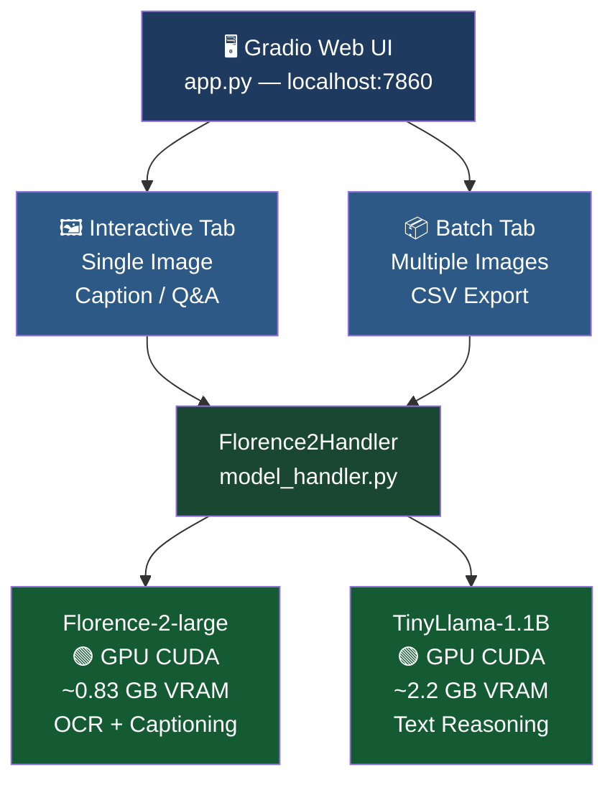
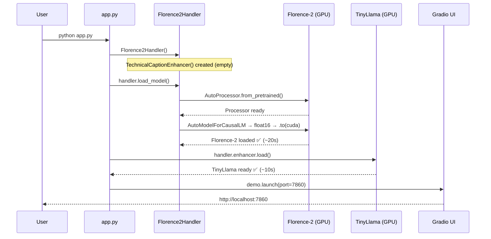
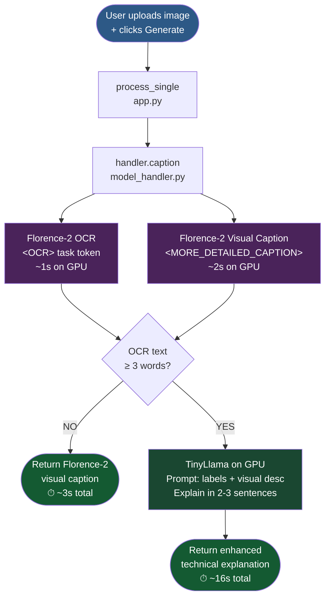
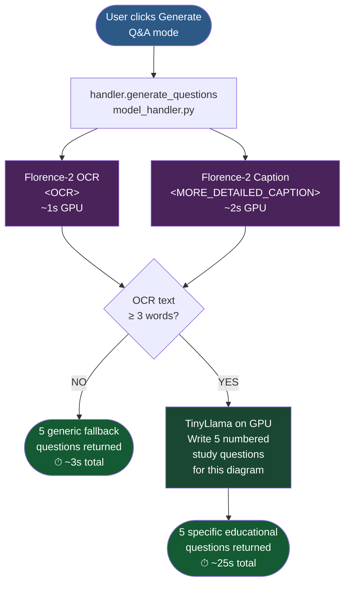
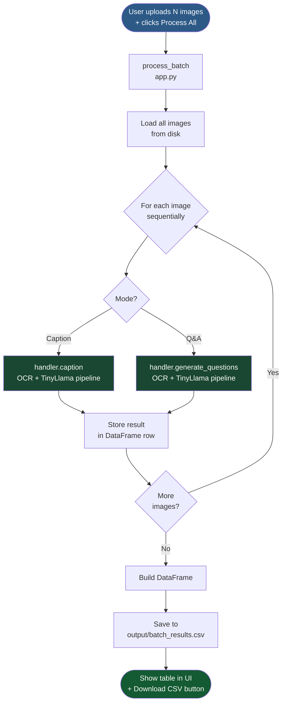
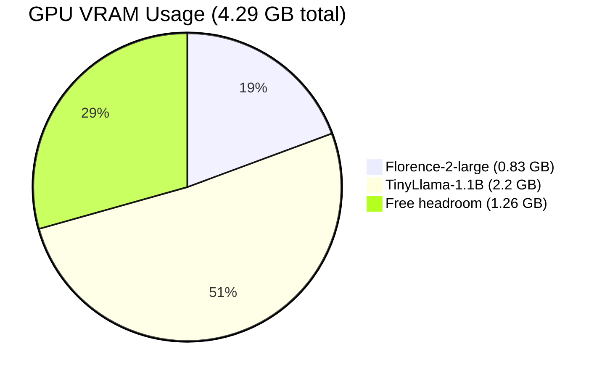

# Multimodal Instructional Assistant — Process Diagrams

---

## 1. System Architecture

---

## 2. App Startup Sequence

---

## 3. Caption Pipeline

---

## 4. Q&A Generation Pipeline

---

## 5. Batch Processing Pipeline

---

## 6. VRAM Memory Layout

